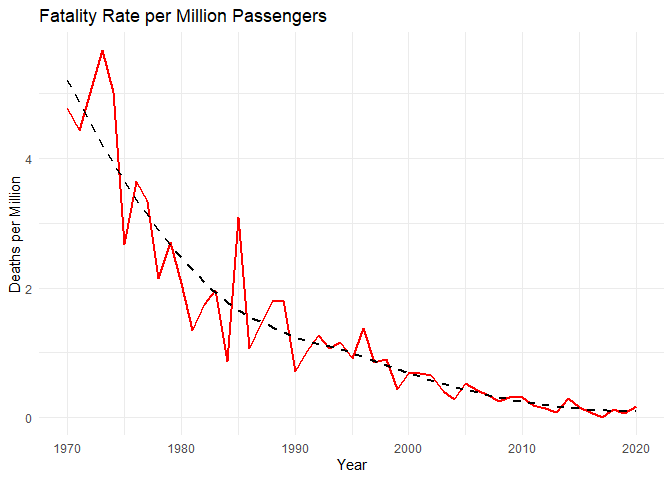

Global Trends Analysis
================
Madison McCann
2025-12-08

``` r
library(tidyverse)
```

    ## ── Attaching core tidyverse packages ──────────────────────── tidyverse 2.0.0 ──
    ## ✔ dplyr     1.1.4     ✔ readr     2.1.5
    ## ✔ forcats   1.0.0     ✔ stringr   1.5.1
    ## ✔ ggplot2   3.5.2     ✔ tibble    3.3.0
    ## ✔ lubridate 1.9.4     ✔ tidyr     1.3.1
    ## ✔ purrr     1.1.0     
    ## ── Conflicts ────────────────────────────────────────── tidyverse_conflicts() ──
    ## ✖ dplyr::filter() masks stats::filter()
    ## ✖ dplyr::lag()    masks stats::lag()
    ## ℹ Use the conflicted package (<http://conflicted.r-lib.org/>) to force all conflicts to become errors

``` r
library(ggplot2)
library(knitr)
library(scales)
```

    ## 
    ## Attaching package: 'scales'
    ## 
    ## The following object is masked from 'package:purrr':
    ## 
    ##     discard
    ## 
    ## The following object is masked from 'package:readr':
    ## 
    ##     col_factor

Introduction

The aviation industry has witnessed a paradox: as the number of
passengers carried has skyrocketed, the rate of fatalities and accidents
has plummeted. This report investigates the historical trajectory of
aviation safety compared to global tourism expansion between 1970 and
2020. My goal is to determine if the “fear of flying” is supported by
data in the modern era.

Data

-air-passengers-carried.csv: Total volume of global air travelers.
-aviation-fatalities-per-million-passengers.csv: Standardized safety
metric for loss of life.
-fatal-airliner-accidents-per-million-flights.csv: Standardized safety
metric for mechanical/human failure.
-international-tourist-arrivals.csv: General growth of global tourism.

``` r
# Load raw datasets
passengers_raw <- read_csv("air-passengers-carried.csv")
```

    ## Rows: 8189 Columns: 4
    ## ── Column specification ────────────────────────────────────────────────────────
    ## Delimiter: ","
    ## chr (2): Entity, Code
    ## dbl (2): Year, Air transport, passengers carried
    ## 
    ## ℹ Use `spec()` to retrieve the full column specification for this data.
    ## ℹ Specify the column types or set `show_col_types = FALSE` to quiet this message.

``` r
safety_raw <- read_csv("aviation-fatalities-per-million-passengers.csv")
```

    ## Rows: 50 Columns: 4
    ## ── Column specification ────────────────────────────────────────────────────────
    ## Delimiter: ","
    ## chr (2): Entity, Code
    ## dbl (2): Year, Fatalities per million passengers
    ## 
    ## ℹ Use `spec()` to retrieve the full column specification for this data.
    ## ℹ Specify the column types or set `show_col_types = FALSE` to quiet this message.

``` r
accidents_raw <- read_csv("fatal-airliner-accidents-per-million-flights.csv")
```

    ## Rows: 50 Columns: 4
    ## ── Column specification ────────────────────────────────────────────────────────
    ## Delimiter: ","
    ## chr (2): Entity, Code
    ## dbl (2): Year, Fatal accidents per million commercial flights
    ## 
    ## ℹ Use `spec()` to retrieve the full column specification for this data.
    ## ℹ Specify the column types or set `show_col_types = FALSE` to quiet this message.

``` r
# Process and merge into a single dataframe 'df'
# We filter for the 'World' aggregate and rename columns for clarity
df <- passengers_raw %>%
  filter(Entity == "World") %>%
  rename(passengers = 4) %>%
  inner_join(
    safety_raw %>% filter(Entity == "World") %>% rename(fatality_rate = 4), 
    by = "Year"
  ) %>%
  inner_join(
    accidents_raw %>% filter(Entity == "World") %>% rename(accident_rate = 4), 
    by = "Year"
  ) %>%
  select(Year, passengers, fatality_rate, accident_rate)


head(df)
```

    ## # A tibble: 6 × 4
    ##    Year passengers fatality_rate accident_rate
    ##   <dbl>      <dbl>         <dbl>         <dbl>
    ## 1  1970  310441408          4.77          6.46
    ## 2  1971  331604896          4.43          4.95
    ## 3  1973  401571808          5.65          6.25
    ## 4  1974  421145216          5.01          6.27
    ## 5  1975  432276512          2.67          4.76
    ## 6  1976  471773408          3.64          5.44

Findings

Chart 1: Global Passenger Volume Growth Flying has truly entered its
“Golden Age” of accessibility. The Chart below shows the transition from
roughly 300 million to over 4 billon annual passengers.

``` r
ggplot(df, aes(x = Year, y = passengers)) +
  geom_area(fill = "steelblue", alpha = 0.5) +
  scale_y_continuous(labels = label_comma()) +
  labs(title = "Total Global Air Passengers Carried (1970-2019)",
       y = "Annual Passengers", 
       x = "Year") +
  theme_minimal()
```

<!-- -->

Visual 2: The Safety Maturity Trend Despite the congestion shown above,
the “standardized risk” (deaths per million) has reached an L-shaped
curve, flattening significantly after the late 1990s.

``` r
ggplot(df, aes(x = Year, y = fatality_rate)) +
  geom_line(color = "red", size = 1) +
  geom_smooth(method = "loess", color = "black", linetype = "dashed", se = FALSE) +
  labs(title = "Fatality Rate per Million Passengers",
       y = "Deaths per Million", 
       x = "Year") +
  theme_minimal()
```

    ## Warning: Using `size` aesthetic for lines was deprecated in ggplot2 3.4.0.
    ## ℹ Please use `linewidth` instead.
    ## This warning is displayed once every 8 hours.
    ## Call `lifecycle::last_lifecycle_warnings()` to see where this warning was
    ## generated.

    ## `geom_smooth()` using formula = 'y ~ x'

<!-- --> Table:
Comparison by Decade The following table summarizes the data using
decadal averages to highlight the long-term shifts in scale and safety.

``` r
df %>%
  mutate(Decade = paste0(floor(Year/10)*10, "s")) %>%
  group_by(Decade) %>%
  summarise(
    Avg_Passengers_Billions = round(mean(passengers)/1e9, 2),
    Avg_Fatality_Rate = round(mean(fatality_rate), 2)
  ) %>%
  kable(caption = "Growth in Global Flight vs. Standardization of Safety Risk")
```

| Decade | Avg_Passengers_Billions | Avg_Fatality_Rate |
|:-------|------------------------:|------------------:|
| 1970s  |                    0.46 |              3.82 |
| 1980s  |                    0.78 |              1.72 |
| 1990s  |                    1.29 |              0.97 |
| 2000s  |                    1.92 |              0.46 |
| 2010s  |                    3.45 |              0.15 |
| 2020s  |                    1.81 |              0.17 |

Growth in Global Flight vs. Standardization of Safety Risk

Curiosity & Scepticism Scepticism: One might wonder if better safety is
just a result of luck or bigger planes. However, our internal comparison
of fatality rates against accident_rate shows that actual technical
failures (accidents per million flights) have fallen alongside passenger
deaths. This confirms that systemic engineering and regulation—rather
than chance—are driving these trends.

Conclusion Aviation is significantly safer today than at any point in
the 20th century. While we fly 15 times more than our predecessors in
the 1970s, our individual risk is a fraction of what it was then. Future
research should look into whether modern pilot shortages or extreme
weather patterns might threaten this stability.
