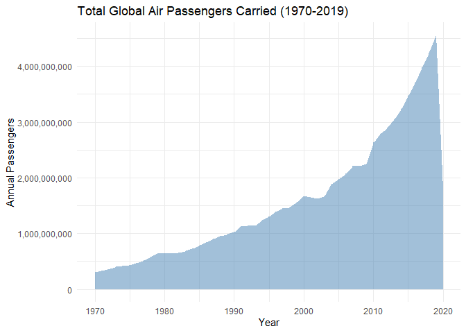
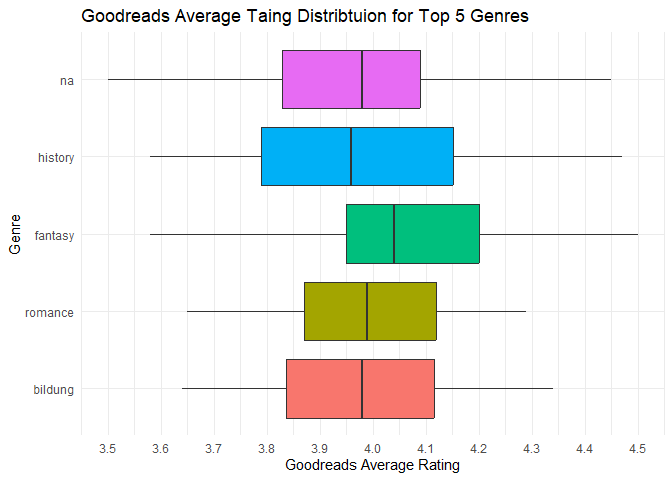
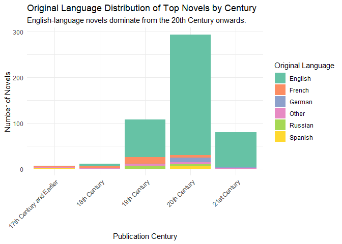
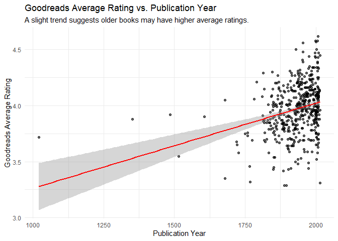
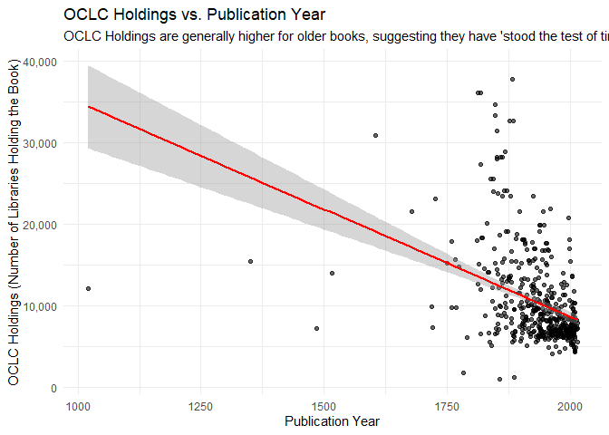

Historical Analysis of Novels
================
Madison McCann
2025-12-08

``` r
library(tidyverse)
```

    ## ── Attaching core tidyverse packages ──────────────────────── tidyverse 2.0.0 ──
    ## ✔ dplyr     1.1.4     ✔ readr     2.1.5
    ## ✔ forcats   1.0.0     ✔ stringr   1.5.1
    ## ✔ ggplot2   3.5.2     ✔ tibble    3.3.0
    ## ✔ lubridate 1.9.4     ✔ tidyr     1.3.1
    ## ✔ purrr     1.1.0     
    ## ── Conflicts ────────────────────────────────────────── tidyverse_conflicts() ──
    ## ✖ dplyr::filter() masks stats::filter()
    ## ✖ dplyr::lag()    masks stats::lag()
    ## ℹ Use the conflicted package (<http://conflicted.r-lib.org/>) to force all conflicts to become errors

``` r
library(ggplot2)

df <- read.csv("top-500-novels-metadata_2025-01-11.csv")

df <- df |>
  mutate(
    publication_century = case_when(
      pub_year <= 1700 ~ "17th Century and Earlier",
      pub_year <= 1800 ~ "18th Century",
      pub_year <= 1900 ~ "19th Century",
      pub_year <= 2000 ~ "20th Century",
      TRUE ~ "21st Century"
    )
  )

century_order <- c("17th Century and Earlier", "18th Century", "19th Century", "20th Century", "21st Century")
df$publication_century <- factor(df$publication_century, levels = century_order, ordered = TRUE)

df <- df |>
  mutate(
    oclc_holdings_clean = as.numeric(gsub(",", "", as.character(oclc_holdings))),
    gr_num_ratings_clean = as.numeric(gsub(",", "", gr_num_ratings))
  )
```

``` r
#ANALYSIS QUESTION 1: How has the distribution of top-ranked novel's publication years changed over time?

century_counts <- df |>
  count(publication_century, name = "novel_count")

print("Novel Counts by Publication Century:")
```

    ## [1] "Novel Counts by Publication Century:"

``` r
print (century_counts)
```

    ##        publication_century novel_count
    ## 1 17th Century and Earlier           7
    ## 2             18th Century          11
    ## 3             19th Century         108
    ## 4             20th Century         294
    ## 5             21st Century          80

``` r
#VISUAL 1: BAR CHART OF NOVELS BY PUBLICATION CENTURY
pub_year_plot <- ggplot(century_counts, aes(x = publication_century, y = novel_count, fill = publication_century)) +
  geom_bar(stat = "identity") +
  geom_text(aes(label = novel_count), vjust = -0.5, size = 3) +
  labs(
    title = "Distribution of Top 500 Novels by Publication Century",
    x = "Publication Century",
    y = "Number of Novels",
    fill = "Century"
  ) +
  theme_minimal() +
  theme(
    axis.text.x = element_text(angle = 45, hjust = 1),
    legend.position = "none"
  )

print(pub_year_plot)
```

<!-- -->

``` r
ggsave("novels_by_century_bar_char.png", plot = pub_year_plot, width = 7, height = 5)
```

``` r
#ANALYSIS QUESTION 2: Is there a relationship between a novel's genre and its Goodreads Average Rating?

top_genres <- df |>
  count(genre, sort = TRUE)|>
  slice_head(n = 5)|>
  pull(genre)

df_top_genres <- df |>
  filter(genre %in% top_genres)

df_top_genres$genre <- factor(df_top_genres$genre, levels = rev(top_genres))
```

``` r
#VISUAL 2: BOX PLOT OF AVERAGE RATING BY TOP 5 GENRE

genre_rating_plot <- ggplot(df_top_genres, aes(x = gr_avg_rating, y = genre, fill = genre)) +
  geom_boxplot() +
  labs(
    title = "Goodreads Average Taing Distribtuion for Top 5 Genres",
    x = "Goodreads Average Rating",
    y = "Genre",
    fill = "genre"
  ) +
  scale_x_continuous(limits = c(3.5, 4.5), breaks = seq(3.5, 4.5, 0.1)) +
  theme_minimal() +
  theme(legend.position = "none")

print(genre_rating_plot)
```

    ## Warning: Removed 19 rows containing non-finite outside the scale range
    ## (`stat_boxplot()`).

<!-- -->

``` r
ggsave("avg_rating_by_top_genre_boxplot.png", plot = genre_rating_plot, width = 7, height = 5)
```

    ## Warning: Removed 19 rows containing non-finite outside the scale range
    ## (`stat_boxplot()`).

``` r
#ANALYSIS QUESTION 3: Has the original language of the top novels shifted over time?

languages_of_interest <- c("English", "French", "Russian", "German", "Spanish")

df_lang_grouped <- df |>
  mutate(
    orig_lang_grouped = case_when(
      orig_lang %in% languages_of_interest ~ orig_lang,
      TRUE ~ "Other"
    )
  )

lang_century_counts <- df_lang_grouped |>
  group_by(publication_century, orig_lang_grouped) |>
  count(name = "novel_count") |>
  ungroup() 
```

``` r
#VISUAL 3: STACKED BAR CHART OF LANGUAGE BY PUBLICATION CENTURY

lang_dominance_plot <- ggplot(lang_century_counts, aes(x = publication_century, y = novel_count, fill = orig_lang_grouped)) +
  geom_bar(stat = "identity", position =  "stack") +
  labs(
    title = "Original Language Distribution of Top Novels by Century",
    subtitle = "English-language novels dominate from the 20th Century onwards.",
    x = "Publication Century",
    y = "Number of Novels",
    fill = "Original Language"
  ) +
  scale_fill_brewer(palette = "Set2") +
  theme_minimal() +
  theme(
    axis.text.x = element_text(angle = 45, hjust = 1)
  )

print(lang_dominance_plot)
```

<!-- -->

``` r
ggsave("lang_dominance_by_century_stacked_bar.png", plot = lang_dominance_plot, width = 8, height = 6)
```

``` r
#ANALYSIS QUESTION 4: Does the average rating (gr_avg_rating) or library holdings (oclc_holdings) correlate with age (pub_year)?

#VISUAL 4A: SCATTER PLOT OF PUBLICATION YEAR VS GOODREADS AVERAGE RATING
age_rating_plot <- ggplot(df, aes(x = pub_year, y = gr_avg_rating)) +
  geom_point(alpha = 0.6) +
  geom_smooth(method = "lm", col = "red") +
  labs(
    title = "Goodreads Average Rating vs. Publication Year",
    subtitle = "A slight trend suggests older books may have higher average ratings. ",
    x = "Publication Year",
    y = "Goodreads Average Rating"
  ) + 
  theme_minimal()

print(age_rating_plot)
```

    ## `geom_smooth()` using formula = 'y ~ x'

<!-- -->

``` r
ggsave("age_vs_avg_rating_scatter.png", plot = age_rating_plot, width = 7, height = 5
       )
```

    ## `geom_smooth()` using formula = 'y ~ x'

``` r
#VISUAL 4B: SCATTER PLOT OF PUBLICATION YEAR VS. OCLC HOLDINGS

age_holdings_plot <- ggplot(df, aes (x = pub_year, y = oclc_holdings_clean)) +
  geom_point(alpha = 0.6) +
  geom_smooth(method = "lm", col = "red") +
  scale_y_continuous(labels = scales::comma) +
  labs(
    title = "OCLC Holdings vs. Publication Year",
    subtitle = "OCLC Holdings are generally higher for older books, suggesting they have 'stood the test of time'.",
    x = "Publication Year",
    y = "OCLC Holdings (Number of Libraries Holding the Book)"
  ) +
  theme_minimal()

print(age_holdings_plot)
```

    ## `geom_smooth()` using formula = 'y ~ x'

    ## Warning: Removed 5 rows containing non-finite outside the scale range
    ## (`stat_smooth()`).

    ## Warning: Removed 5 rows containing missing values or values outside the scale range
    ## (`geom_point()`).

<!-- -->

``` r
ggsave("age_vs_holdings_scatter.png", plot = age_holdings_plot, width = 7, height = 5)
```

    ## `geom_smooth()` using formula = 'y ~ x'

    ## Warning: Removed 5 rows containing non-finite outside the scale range (`stat_smooth()`).
    ## Removed 5 rows containing missing values or values outside the scale range
    ## (`geom_point()`).
